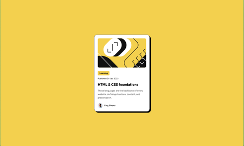

# Frontend Mentor - Blog preview card solution

This is a solution to the [Blog preview card challenge on Frontend Mentor](https://www.frontendmentor.io/challenges/blog-preview-card-ckPaj01IcS). Frontend Mentor challenges help you improve your coding skills by building realistic projects. 

## Table of contents
- [Frontend Mentor - Blog preview card solution](#frontend-mentor---blog-preview-card-solution)
  - [Table of contents](#table-of-contents)
  - [Overview](#overview)
    - [Screenshot](#screenshot)
    - [Links](#links)
    - [Built with](#built-with)
    - [What I learned](#what-i-learned)
    - [Useful resources](#useful-resources)

## Overview
A small project to build a blog preview card which has a link to the main blog post. The card has an image, title, and a brief summary of the post.

### Screenshot

### Links
- Live Site URL: [https://py-code314.github.io/blog-preview-card/](https://py-code314.github.io/blog-preview-card/)

### Built with
- Semantic HTML5 markup
- CSS custom properties
- Flexbox

### What I learned
- I learned how to use @font-face rule and CSS custom properties to create the blog preview card.

### Useful resources
- [How to load variable fonts in CSS](https://web.dev/articles/variable-fonts)

